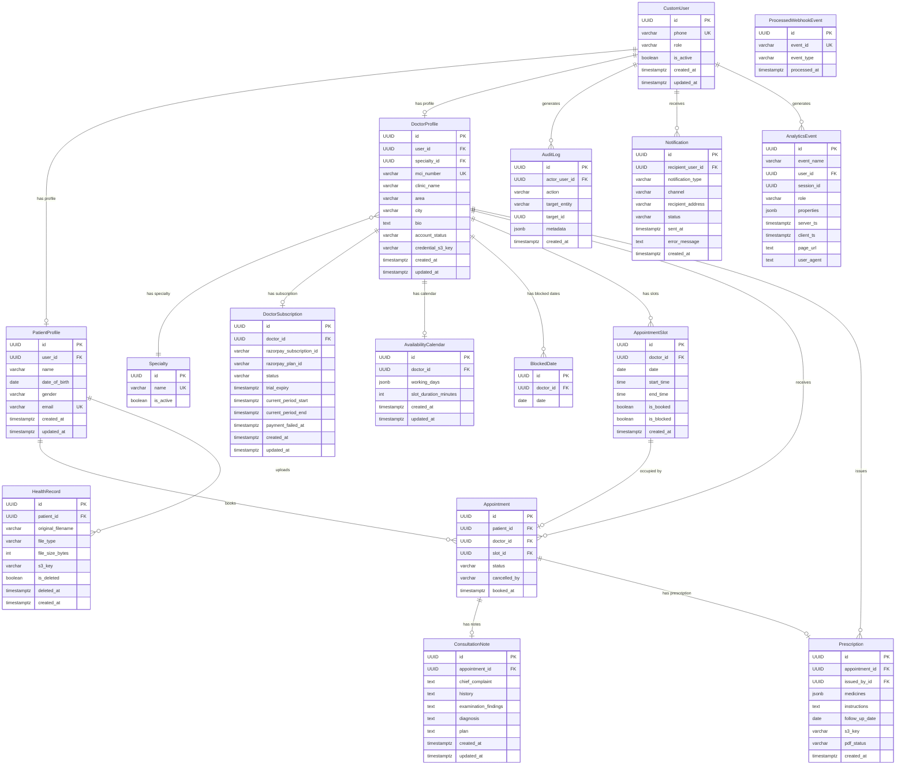

# Data Model — MedSlot

**Phase:** 4 — Architecture
**Version:** 1.0
**Date:** 2026-05-25
**Framework:** Domain-Driven Design entity modeling + PostgreSQL relational best practices

---

## Entity Relationship Diagram

---

## Entity Definitions

### `CustomUser`

| Attribute | Type | Constraints | Nullable | Notes |
|-----------|------|-------------|---------|-------|
| id | UUID | PK, DEFAULT gen_random_uuid() | NO | |
| phone | VARCHAR(15) | UNIQUE | NO | # PHI — Indian mobile numbers; E.164 format |
| role | VARCHAR(10) | CHECK (role IN ('patient','doctor','admin')) | NO | |
| is_active | BOOLEAN | DEFAULT true | NO | false = suspended/deactivated |
| created_at | TIMESTAMPTZ | DEFAULT now() | NO | |
| updated_at | TIMESTAMPTZ | DEFAULT now() | NO | |

---

### `PatientProfile`

| Attribute | Type | Constraints | Nullable | Notes |
|-----------|------|-------------|---------|-------|
| id | UUID | PK | NO | |
| user_id | UUID | FK → CustomUser.id, UNIQUE, ON DELETE CASCADE | NO | |
| name | VARCHAR(255) | | NO | # PHI |
| date_of_birth | DATE | | NO | # PHI |
| gender | VARCHAR(10) | CHECK (gender IN ('Male','Female','Other')) | NO | # PHI |
| email | VARCHAR(254) | UNIQUE | NO | # PHI — RFC 5322 validated |
| created_at | TIMESTAMPTZ | DEFAULT now() | NO | |
| updated_at | TIMESTAMPTZ | DEFAULT now() | NO | |

---

### `DoctorProfile`

| Attribute | Type | Constraints | Nullable | Notes |
|-----------|------|-------------|---------|-------|
| id | UUID | PK | NO | |
| user_id | UUID | FK → CustomUser.id, UNIQUE, ON DELETE CASCADE | NO | |
| specialty_id | UUID | FK → Specialty.id | NO | |
| mci_number | VARCHAR(50) | UNIQUE | NO | MCI/state council registration number |
| clinic_name | VARCHAR(255) | | NO | |
| area | VARCHAR(255) | | NO | Sub-city locality |
| city | VARCHAR(100) | | NO | Indexed — primary search filter |
| bio | TEXT | | YES | |
| account_status | VARCHAR(20) | CHECK (IN ('Pending','Approved','Rejected','Suspended')), DEFAULT 'Pending' | NO | |
| credential_s3_key | VARCHAR(500) | | NO | S3 key for credential PDF; admin access only |
| created_at | TIMESTAMPTZ | DEFAULT now() | NO | |
| updated_at | TIMESTAMPTZ | DEFAULT now() | NO | |

---

### `Specialty`

| Attribute | Type | Constraints | Nullable | Notes |
|-----------|------|-------------|---------|-------|
| id | UUID | PK | NO | |
| name | VARCHAR(100) | UNIQUE | NO | Seeded at deploy; 13 fixed values |
| is_active | BOOLEAN | DEFAULT true | NO | |

**Seed data (13 specialties):** General Physician, Dermatologist, Cardiologist, Orthopedist, Gynecologist & Obstetrics, Pediatrician, ENT Specialist, Ophthalmologist, Psychiatrist, Dentist, Neurologist, Diabetologist, General Surgeon

---

### `DoctorSubscription`

| Attribute | Type | Constraints | Nullable | Notes |
|-----------|------|-------------|---------|-------|
| id | UUID | PK | NO | |
| doctor_id | UUID | FK → DoctorProfile.id, UNIQUE, ON DELETE CASCADE | NO | |
| razorpay_subscription_id | VARCHAR(100) | | YES | NULL during trial; set on Razorpay activation |
| razorpay_plan_id | VARCHAR(100) | | YES | |
| status | VARCHAR(20) | CHECK (IN ('Trial','Active','Payment_Failed','Cancelled','Paused')), DEFAULT 'Trial' | NO | |
| trial_expiry | TIMESTAMPTZ | | NO | Set to account_approval_date + 30 days |
| current_period_start | TIMESTAMPTZ | | YES | Set from Razorpay webhook |
| current_period_end | TIMESTAMPTZ | | YES | Set from Razorpay webhook |
| payment_failed_at | TIMESTAMPTZ | | YES | Set when status → Payment_Failed |
| created_at | TIMESTAMPTZ | DEFAULT now() | NO | |
| updated_at | TIMESTAMPTZ | DEFAULT now() | NO | |

---

### `AvailabilityCalendar`

| Attribute | Type | Constraints | Nullable | Notes |
|-----------|------|-------------|---------|-------|
| id | UUID | PK | NO | |
| doctor_id | UUID | FK → DoctorProfile.id, UNIQUE, ON DELETE CASCADE | NO | |
| working_days | JSONB | NOT NULL | NO | Structure: `{"mon": {"start": "09:00", "end": "13:00"}, "wed": {...}}` |
| slot_duration_minutes | INTEGER | CHECK (IN (15,30,45,60)), DEFAULT 30 | NO | |
| created_at | TIMESTAMPTZ | DEFAULT now() | NO | |
| updated_at | TIMESTAMPTZ | DEFAULT now() | NO | |

---

### `BlockedDate`

| Attribute | Type | Constraints | Nullable | Notes |
|-----------|------|-------------|---------|-------|
| id | UUID | PK | NO | |
| doctor_id | UUID | FK → DoctorProfile.id, ON DELETE CASCADE | NO | |
| date | DATE | | NO | |
| — | — | UNIQUE(doctor_id, date) | — | |

---

### `AppointmentSlot`

| Attribute | Type | Constraints | Nullable | Notes |
|-----------|------|-------------|---------|-------|
| id | UUID | PK | NO | |
| doctor_id | UUID | FK → DoctorProfile.id, ON DELETE CASCADE | NO | |
| date | DATE | | NO | |
| start_time | TIME | | NO | IST timezone stored as time; context from date |
| end_time | TIME | | NO | |
| is_booked | BOOLEAN | DEFAULT false | NO | True when an Appointment references this slot |
| is_blocked | BOOLEAN | DEFAULT false | NO | True when a BlockedDate covers this slot date |
| created_at | TIMESTAMPTZ | DEFAULT now() | NO | |
| — | — | UNIQUE(doctor_id, date, start_time) | — | Prevents duplicate slot generation |

---

### `Appointment`

| Attribute | Type | Constraints | Nullable | Notes |
|-----------|------|-------------|---------|-------|
| id | UUID | PK | NO | |
| patient_id | UUID | FK → PatientProfile.id | NO | # PHI (FK context) |
| doctor_id | UUID | FK → DoctorProfile.id | NO | |
| slot_id | UUID | FK → AppointmentSlot.id, UNIQUE | NO | UNIQUE enforces one appointment per slot |
| status | VARCHAR(20) | CHECK (IN ('Scheduled','In_Consultation','Completed','Cancelled','No_Show')), DEFAULT 'Scheduled' | NO | |
| cancelled_by | VARCHAR(10) | CHECK (IN ('patient','doctor')) | YES | NULL if not cancelled |
| booked_at | TIMESTAMPTZ | DEFAULT now() | NO | |

**Application-enforced constraint:** `UNIQUE(patient_id, doctor_id, slot.date)` — checked in service layer before INSERT (no DB-level constraint because `slot.date` is in AppointmentSlot, not Appointment).

---

### `ConsultationNote`

| Attribute | Type | Constraints | Nullable | Notes |
|-----------|------|-------------|---------|-------|
| id | UUID | PK | NO | |
| appointment_id | UUID | FK → Appointment.id, UNIQUE, ON DELETE CASCADE | NO | |
| chief_complaint | TEXT | | NO | # PHI — required before prescription |
| history | TEXT | | YES | # PHI |
| examination_findings | TEXT | | YES | # PHI |
| diagnosis | TEXT | | NO | # PHI — required before prescription |
| plan | TEXT | | YES | # PHI |
| created_at | TIMESTAMPTZ | DEFAULT now() | NO | |
| updated_at | TIMESTAMPTZ | DEFAULT now() | NO | Immutable after Appointment.status = Completed |

---

### `Prescription`

| Attribute | Type | Constraints | Nullable | Notes |
|-----------|------|-------------|---------|-------|
| id | UUID | PK | NO | |
| appointment_id | UUID | FK → Appointment.id, UNIQUE, ON DELETE RESTRICT | NO | RESTRICT prevents appointment deletion if prescription exists |
| issued_by_id | UUID | FK → DoctorProfile.id | NO | |
| medicines | JSONB | NOT NULL | NO | # PHI — array of `{name, dosage, frequency, duration}` |
| instructions | TEXT | | YES | # PHI |
| follow_up_date | DATE | | YES | |
| s3_key | VARCHAR(500) | | YES | NULL until PDF generated |
| pdf_status | VARCHAR(20) | CHECK (IN ('pending','complete','failed')), DEFAULT 'pending' | NO | |
| created_at | TIMESTAMPTZ | DEFAULT now() | NO | Immutable — no UPDATE permitted (FR-RX-008, BR-024) |

---

### `HealthRecord`

| Attribute | Type | Constraints | Nullable | Notes |
|-----------|------|-------------|---------|-------|
| id | UUID | PK | NO | |
| patient_id | UUID | FK → PatientProfile.id, ON DELETE RESTRICT | NO | |
| original_filename | VARCHAR(255) | | NO | # PHI — may contain patient-identifying info |
| file_type | VARCHAR(10) | CHECK (IN ('pdf','jpg','jpeg','png')) | NO | |
| file_size_bytes | INTEGER | CHECK (file_size_bytes <= 10485760) | NO | 10MB max |
| s3_key | VARCHAR(500) | | NO | `records/{patient_id}/{uuid}.{ext}` |
| is_deleted | BOOLEAN | DEFAULT false | NO | Soft delete; S3 object retained (BR-022) |
| deleted_at | TIMESTAMPTZ | | YES | |
| created_at | TIMESTAMPTZ | DEFAULT now() | NO | |

---

### `AuditLog`

| Attribute | Type | Constraints | Nullable | Notes |
|-----------|------|-------------|---------|-------|
| id | UUID | PK | NO | |
| actor_user_id | UUID | FK → CustomUser.id, ON DELETE SET NULL | YES | NULL if system action |
| action | VARCHAR(100) | | NO | e.g., 'prescription.issued', 'doctor.approved', 'health_record.deleted' |
| target_entity | VARCHAR(50) | | NO | Django model name |
| target_id | UUID | | NO | PK of the affected record |
| metadata | JSONB | DEFAULT '{}' | NO | Non-PHI context only |
| created_at | TIMESTAMPTZ | DEFAULT now() | NO | Immutable — append-only |

**Mandatory audit events (NFR-MAIN-004):** prescription.issued, health_record.uploaded, health_record.deleted, doctor.approved, doctor.rejected, doctor.suspended, doctor.reactivated

---

### `Notification`

| Attribute | Type | Constraints | Nullable | Notes |
|-----------|------|-------------|---------|-------|
| id | UUID | PK | NO | |
| recipient_user_id | UUID | FK → CustomUser.id | NO | |
| notification_type | VARCHAR(50) | | NO | e.g., 'booking_confirmation', 'prescription_delivery', 'appointment_reminder' |
| channel | VARCHAR(10) | CHECK (IN ('email','sms')) | NO | |
| recipient_address | VARCHAR(254) | | NO | # PHI — email or phone number |
| status | VARCHAR(20) | CHECK (IN ('Queued','Sent','Failed')), DEFAULT 'Queued' | NO | |
| sent_at | TIMESTAMPTZ | | YES | |
| error_message | TEXT | | YES | |
| created_at | TIMESTAMPTZ | DEFAULT now() | NO | |

---

### `AnalyticsEvent` *(schema: `analytics`)*

| Attribute | Type | Constraints | Nullable | Notes |
|-----------|------|-------------|---------|-------|
| id | UUID | PK, DEFAULT gen_random_uuid() | NO | |
| event_name | VARCHAR(100) | | NO | |
| user_id | UUID | FK → CustomUser.id, ON DELETE SET NULL | YES | NULL for anonymous events |
| session_id | UUID | | YES | Client-generated per browser session |
| role | VARCHAR(20) | CHECK (IN ('patient','doctor','admin')) | YES | |
| properties | JSONB | DEFAULT '{}' | NO | No PHI — validated before write |
| server_ts | TIMESTAMPTZ | DEFAULT now() | NO | Authoritative timestamp |
| client_ts | TIMESTAMPTZ | | YES | For latency analysis only |
| page_url | TEXT | | YES | |
| user_agent | TEXT | | YES | |

---

### `ProcessedWebhookEvent`

| Attribute | Type | Constraints | Nullable | Notes |
|-----------|------|-------------|---------|-------|
| id | UUID | PK | NO | |
| event_id | VARCHAR(100) | UNIQUE | NO | Razorpay event ID for idempotency |
| event_type | VARCHAR(100) | | NO | |
| processed_at | TIMESTAMPTZ | DEFAULT now() | NO | |

---

## Index Strategy

| Table | Indexed Columns | Index Type | Query Pattern Served | Justification |
|-------|----------------|------------|---------------------|---------------|
| CustomUser | phone | B-tree UNIQUE | OTP verification lookup; login | Every auth request hits this index |
| PatientProfile | user_id | B-tree UNIQUE | Profile fetch by user | Foreign key lookup on every auth request |
| PatientProfile | email | B-tree UNIQUE | Email uniqueness check on registration | FR-REG-PAT-003 validation |
| DoctorProfile | user_id | B-tree UNIQUE | Profile fetch by user | Every doctor API request |
| DoctorProfile | (city, account_status) | B-tree composite | Doctor search filter: `WHERE city = ? AND account_status = 'Approved'` | FR-SEARCH-001, FR-SEARCH-002 — primary search query |
| DoctorProfile | specialty_id | B-tree | Doctor search filter: `WHERE specialty_id = ?` | FR-SEARCH-002 — specialty filter |
| DoctorProfile | account_status | B-tree | Admin panel pending list | FR-ADMIN-001 |
| AppointmentSlot | (doctor_id, date) | B-tree composite | Slot lookup per doctor per date; booking and profile display | FR-PROFILE-002, FR-BOOK-001 |
| AppointmentSlot | (doctor_id, date, is_booked) WHERE is_booked = false | B-tree partial | Available slot lookup for doctor profile | FR-PROFILE-002 — hot path query |
| Appointment | patient_id | B-tree | Patient's appointment history | FR-APPT-001 |
| Appointment | (doctor_id, status) | B-tree composite | Doctor today's/upcoming appointments by status | FR-APPT-002, FR-APPT-003 |
| Appointment | slot_id | B-tree UNIQUE | Slot → Appointment join; concurrent booking lock | FR-BOOK-002 |
| ConsultationNote | appointment_id | B-tree UNIQUE | Consultation fetch by appointment | FR-CONSULT-003 |
| Prescription | appointment_id | B-tree UNIQUE | Prescription fetch by appointment | FR-RX-001 |
| HealthRecord | (patient_id, is_deleted) WHERE is_deleted = false | B-tree partial | Patient record listing (excludes soft-deleted) | FR-RECORD-003 |
| AuditLog | actor_user_id | B-tree | Audit trail lookup by user | NFR-MAIN-004 |
| AuditLog | created_at | B-tree | Time-range audit queries | NFR-MAIN-004 |
| AnalyticsEvent | event_name | B-tree | Dashboard queries by event type | PRD-ANALYTICS-PLAN.md dashboards |
| AnalyticsEvent | user_id | B-tree | Per-user funnel analysis | PRD-ANALYTICS-PLAN.md funnels |
| AnalyticsEvent | server_ts | B-tree | Time-range queries; data retention purge | PRD-ANALYTICS-PLAN.md retention |
| ProcessedWebhookEvent | event_id | B-tree UNIQUE | Webhook idempotency check | FR-SUB-006 |

---

## Migration Approach

**Tool:** Django built-in migrations (`django.db.migrations`)

**Conventions:**
- Every schema change requires a migration file committed with the code change
- Migration files are named: `{app}/{number}_{description}.py`
- Migrations run automatically on ECS task startup via `python manage.py migrate` (pre-start lifecycle hook)
- Destructive migrations (DROP COLUMN, DROP TABLE, removing NOT NULL without a default) require:
  1. A human review gate — flagged in PR with label `destructive-migration`
  2. A prior migration to make the column nullable (zero-downtime pattern)
  3. A separate migration to drop the column after the code deployment

**Rollback strategy:**
- Django migrations support `python manage.py migrate <app> <previous_migration_number>` for rollback
- All migration files include a `database_backwards` method when the forward migration is reversible
- Irreversible migrations (e.g., data transformations) are documented with an explicit comment: `# IRREVERSIBLE: cannot be automatically rolled back`

**Seeding:**
- Specialty table seeded via a Django data migration in the `accounts` app initial migration
- Seed is idempotent: uses `get_or_create` to prevent duplicate inserts on re-run

---

## Data Retention Policy

| Entity | Retention Period | Mechanism | Authority |
|--------|-----------------|-----------|-----------|
| ConsultationNote | 10 years from appointment date | No delete permitted (FR-CONSULT-004); AuditLog records retained with note | BR-022, NFR-MAIN-004 |
| Prescription | 10 years from issuance date | No delete permitted (FR-RX-008, BR-024) | BR-022, medical regulatory practice |
| PrescriptionPDF (S3) | 10 years | S3 object lifecycle: no automatic deletion; S3-IA transition after 1 year | BR-022 |
| HealthRecord | 10 years (soft delete only — S3 retained) | is_deleted=true; S3 object never deleted | BR-022, A-02-012 |
| HealthRecord (S3) | 10 years minimum | S3 lifecycle: Glacier transition after 2 years | BR-022 |
| Appointment | 10 years | No delete permitted (source of medical record chain) | BR-022 |
| PatientProfile | 10 years from last activity | Soft delete on account deactivation; hard delete only on verified legal request | BR-022 |
| DoctorProfile | 10 years from last activity | Same as PatientProfile | BR-022 |
| Notification | 2 years | Automated DELETE job (monthly) | REQUIREMENTS.md 5.1 |
| AnalyticsEvent | 24 months | Automated DELETE job (monthly): `DELETE FROM analytics.analytics_events WHERE server_ts < NOW() - INTERVAL '24 months'` | A-03-003 |
| AuditLog | 7 years | No delete permitted; compliance artifact | NFR-MAIN-004 |
| DoctorCredential (S3) | 10 years | No automatic deletion | Regulatory — MCI verification |
